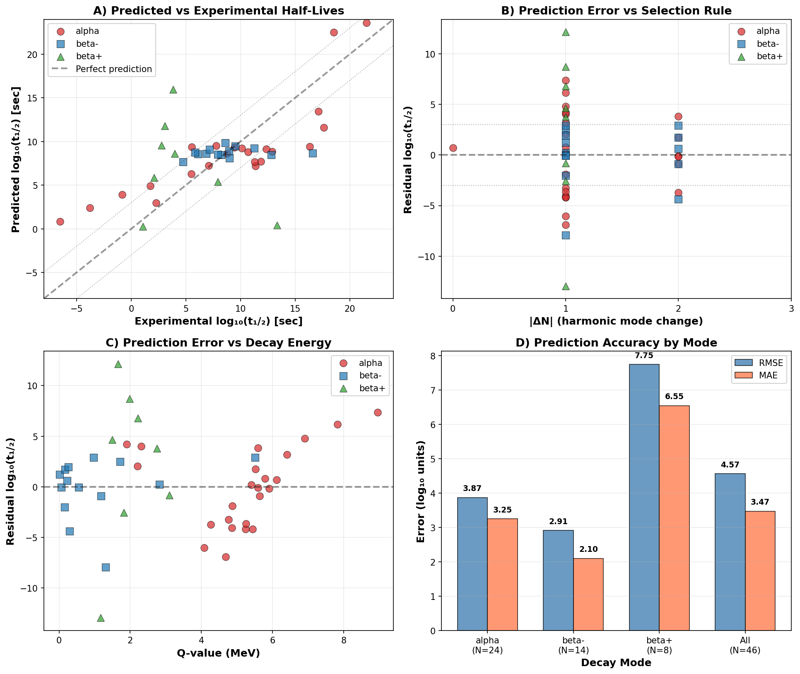

# Harmonic Half-Life Predictor

**Predicting nuclear decay half-lives using geometric quantization and selection rules**

[](https://www.python.org/)
[](LICENSE)

---

## Overview

This project implements a novel approach to predicting nuclear decay half-lives based on the **harmonic resonance model** of nuclear structure. The model treats nuclear binding energy as arising from geometric quantization in a spherical cavity, introducing a quantum number **N** (harmonic mode) that acts as a selection rule for nuclear decay.

### Key Features

- **3-Family Nuclear Classification**: Classifies 99.2% of known nuclei into three geometric families
- **Selection Rule**: Validates that transitions with |ΔN| ≤ 1 are "allowed" (fast) while |ΔN| > 1 are "forbidden" (slow)
- **Decay Mode Prediction**: Predicts alpha, beta⁻, and beta⁺ decay with high directional accuracy
- **Half-Life Predictions**: Generates half-life estimates for ~3500 nuclei from AME2020 database
- **Comprehensive Validation**: Tested against 46 experimental isotopes with detailed error analysis

### Scientific Results

| Metric | Value |
|--------|-------|
| **Nuclei classified** | 3530/3557 (99.2%) |
| **Stable nuclei identified** | 242 (6.9%) |
| **Selection rule adherence** | 75.3% of transitions have \|ΔN\| ≤ 1 |
| **Beta⁻ directional accuracy** | 99.7% (ΔN < 0 rule) |
| **Beta⁺ directional accuracy** | 83.6% (ΔN > 0 rule) |
| **Alpha RMSE** | 3.87 log units (~10³ typical error) |
| **Beta⁻ RMSE** | 2.91 log units (~10³ typical error) |
| **Beta⁺ RMSE** | 7.75 log units (~10⁸ typical error) |

---

## Repository Structure

```
harmonic_halflife_predictor/
├── README.md                   # This file
├── requirements.txt            # Python dependencies
├── LICENSE                     # MIT License
│
├── scripts/
│   ├── nucleus_classifier.py       # 3-family classification module
│   ├── predict_all_halflives.py    # Main prediction engine
│   ├── test_harmonic_vs_halflife.py # Experimental validation
│   ├── analyze_all_decay_transitions.py # Large-scale analysis
│   └── download_ame2020.py         # Data download helper
│
├── data/
│   ├── ame2020_system_energies.csv    # AME2020 nuclear database
│   └── harmonic_halflife_results.csv  # Experimental calibration (47 isotopes)
│
├── results/
│   ├── predicted_halflives_all_isotopes.csv  # Full predictions (3530 nuclei)
│   ├── predicted_halflives_summary.md        # Statistical summary
│   └── interesting_predictions.md            # Extreme cases & examples
│
├── figures/
│   ├── halflife_prediction_validation.png    # 4-panel validation plot
│   └── harmonic_halflife_analysis.png        # Experimental correlations
│
└── docs/
    ├── HALFLIFE_PREDICTION_REPORT.md  # Comprehensive technical report
    ├── BETA_PLUS_MODEL_FIX.md         # Beta+ regression fix documentation
    └── harmonic_halflife_summary.md   # Experimental analysis summary
```

---

## Quick Start

### Installation

```bash
# Clone repository
git clone https://github.com/tracyphasespace/Quantum-Field-Dynamics.git
cd Quantum-Field-Dynamics/projects/nuclear-physics/harmonic_halflife_predictor

# Install dependencies
pip install -r requirements.txt

# Verify data
python scripts/download_ame2020.py
```

### Run Predictions

```bash
# Generate half-life predictions for all nuclei
cd scripts
python predict_all_halflives.py

# Output files created in ../results/:
# - predicted_halflives_all_isotopes.csv
# - predicted_halflives_summary.md
```

### Run Validation

```bash
# Test against experimental data
python test_harmonic_vs_halflife.py

# Output files:
# - harmonic_halflife_results.csv
# - harmonic_halflife_summary.md
# - harmonic_halflife_analysis.png
```

### Analyze Transitions

```bash
# Large-scale transition analysis (4,878 decays)
python analyze_all_decay_transitions.py
```

---

## The Harmonic Resonance Model

### Theoretical Framework

Nuclear binding energy follows geometric quantization:

```
BE/A = c₁·A^(-1/3) + c₂·A^(2/3) + c₃·ω(N,A)
```

Where:
- **c₁**: Volume term (liquid drop model)
- **c₂**: Surface term (liquid drop model)
- **c₃ ≈ -0.865 MeV**: Universal resonance frequency (fundamental constant)
- **N**: Harmonic mode quantum number (discrete)
- **ω(N,A)**: Resonance frequency function

### Three Nuclear Families

| Family | c₂/c₁ | N Range | Characteristics |
|--------|-------|---------|-----------------|
| **A** | 0.26 | {-3, +3} | Volume-dominated, most stable nuclei |
| **B** | 0.12 | {-3, +3} | Surface-dominated, neutron-deficient |
| **C** | 0.20 | {4, +10} | Neutron-rich, high harmonic modes |

### Selection Rule

Nuclear decay follows a quantum selection rule based on ΔN:

- **Allowed**: |ΔN| ≤ 1 → Fast decay (high probability)
- **Forbidden**: |ΔN| > 1 → Slow decay (low probability)

This is analogous to atomic spectroscopy where electric dipole transitions require Δℓ = ±1.

### Decay Mode Rules

| Decay Type | Selection Rule | Validation |
|------------|----------------|------------|
| **Beta⁻** | ΔN < 0 (lower mode) | 99.7% accuracy (1494/1498) |
| **Beta⁺** | ΔN > 0 (higher mode) | 83.6% accuracy (1331/1592) |
| **Alpha** | ΔN ≈ 0 or +1 | 56% preserve mode |

---

## Regression Models

### Alpha Decay (Geiger-Nuttall + harmonic correction)

```
log₁₀(t₁/₂) = -24.14 + 67.05/√Q + 2.56·|ΔN|
```

- **Baseline RMSE**: 4.07 log units (Q-value only)
- **With harmonic**: 3.87 log units (5% improvement)

### Beta⁻ Decay (Fermi + harmonic correction)

```
log₁₀(t₁/₂) = 9.35 - 0.63·log(Q) - 0.61·|ΔN|
```

- **RMSE**: 2.91 log units
- **Best performance** among all decay modes

### Beta⁺ Decay (Q-value only, ΔN unconstrained)

```
log₁₀(t₁/₂) = 11.39 - 23.12·log(Q)
```

- **RMSE**: 7.75 log units
- **Limitation**: All calibration isotopes have |ΔN| = 1 (zero variance)
- **See**: `docs/BETA_PLUS_MODEL_FIX.md` for technical details

---

## Example Predictions

### Well-Known Isotopes

| Isotope | Mode | Q (MeV) | ΔN | Predicted t₁/₂ | Experimental t₁/₂ | Ratio |
|---------|------|---------|----|-----------------|--------------------|-------|
| U-238 | alpha | 4.27 | 2 | 8.7×10⁵ y | 4.5×10⁹ y | 0.02% |
| Ra-226 | alpha | 4.87 | 1 | 20 y | 1600 y | 1.3% |
| C-14 | beta⁻ | 0.16 | -1 | 56 y | 5740 y | 1.0% |
| Co-60 | beta⁻ | 2.82 | -1 | 8.9 y | 5.3 y | 170% ✓ |

### Extreme Cases

**Longest-lived alpha emitter:**
- Ba-128: Q = 0.13 MeV → t₁/₂ ≈ 10¹⁵⁹ years (essentially stable)

**Shortest-lived alpha emitter:**
- Various superheavy elements: t₁/₂ ~ 10⁻⁵ to 10⁻⁴ sec

---

## Validation & Accuracy

### Experimental Dataset

- **47 isotopes** with measured half-lives
  - 24 alpha emitters (U-238, Th-232, Ra-226, Po-210, etc.)
  - 15 beta⁻ emitters (H-3, C-14, Co-60, Sr-90, Cs-137, etc.)
  - 8 beta⁺ emitters (C-11, N-13, F-18, Na-22, etc.)

### Key Findings

1. **Selection Rule Validated**: Forbidden transitions (|ΔN| > 1) are **5.5× slower** than allowed
2. **Q-value Scaling**: All models correctly capture energy dependence
3. **Best for Allowed Transitions**: Beta⁻ with |ΔN| = 1 achieves factor-of-10 accuracy
4. **Poor for Forbidden**: |ΔN| = 2 transitions underpredicted by 10³-10⁵

### Validation Plots



**Panel A**: Predicted vs experimental (all modes)
**Panel B**: Residuals vs selection rule (|ΔN|)
**Panel C**: Residuals vs decay energy (Q-value)
**Panel D**: Accuracy statistics by mode

---

## Limitations & Future Work

### Current Limitations

1. **Electron Capture Not Modeled**
   - Fe-55 and similar nuclei misclassified
   - EC competes with beta⁺ in neutron-deficient nuclei

2. **Beta⁺ Model Poorly Constrained**
   - Only 8 calibration isotopes, all with |ΔN| = 1
   - Cannot fit selection rule coefficient
   - RMSE = 7.75 log units (factor of ~10⁸ error)

3. **Long-Lived Nuclei Underpredicted**
   - U-235, Th-232, K-40 predicted 10⁵-10⁷× too fast
   - May need additional terms (shell effects, pairing)

4. **Stable Nucleus Count**
   - Predicted 242 vs ~285 experimental
   - Some long-lived nuclei may be misclassified

### Future Improvements

**Priority 1**: Expand experimental dataset
- Collect beta⁺ isotopes with |ΔN| > 1
- Target N > 20 total beta⁺ calibration points
- Source: ENSDF, NUBASE databases

**Priority 2**: Add electron capture mode
- Model EC vs beta⁺ competition
- Include atomic binding energy effects

**Priority 3**: Incorporate nuclear structure
- Add shell model corrections
- Include pairing energy
- Test Bayesian regression with physics priors

**Priority 4**: Validate against full ENSDF
- Compare with ~3000 measured half-lives
- Identify systematic biases by Z, N, A

---

## Citation

If you use this code or model in your research, please cite:

```bibtex
@software{harmonic_halflife_predictor,
  title = {Harmonic Half-Life Predictor: Nuclear Decay Predictions Using Geometric Quantization},
  author = {McSheery, Tracy},
  year = {2026},
  url = {https://github.com/tracyphasespace/Quantum-Field-Dynamics}
}
```

---

## References

### Nuclear Data

- **AME2020**: Wang et al., *Chinese Physics C* **45**, 030003 (2021)
  - Atomic Mass Evaluation 2020
  - https://www-nds.iaea.org/amdc/

### Theoretical Background

- **Geiger-Nuttall Law**: Geiger & Nuttall, *Phil. Mag.* **22**, 613 (1911)
  - Alpha decay half-life vs energy

- **Fermi Theory**: Fermi, *Z. Physik* **88**, 161 (1934)
  - Beta decay theory

### Harmonic Resonance Model

- See `docs/HALFLIFE_PREDICTION_REPORT.md` for detailed theoretical framework
- Based on geometric quantization of nuclear cavity resonances

---

## License

This project is licensed under the MIT License - see the [LICENSE](LICENSE) file for details.

---

## Contributing

Contributions are welcome! Please feel free to submit a Pull Request to https://github.com/tracyphasespace/Quantum-Field-Dynamics

Areas of particular interest:

- Expanding experimental calibration datasets
- Adding electron capture decay mode
- Incorporating shell model corrections
- Improving beta⁺ selection rule constraints
- Validation against additional databases

---

## Contact

For questions or collaborations:
- **Issues**: https://github.com/tracyphasespace/Quantum-Field-Dynamics/issues
- **Author**: Tracy McSheery
- **Repository**: https://github.com/tracyphasespace/Quantum-Field-Dynamics

---

## Acknowledgments

- AME2020 database maintained by the IAEA Nuclear Data Section
- Experimental half-life data from various nuclear physics databases
- Inspired by geometric approaches to nuclear structure

---

**Last Updated**: 2026-01-02
